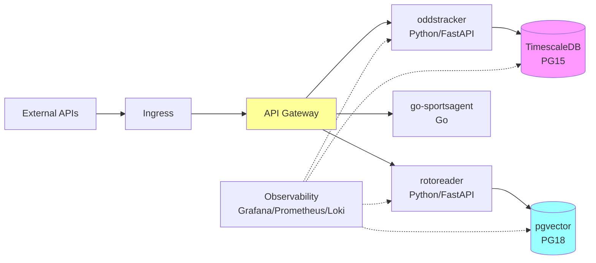

# SportsStack Platform

This repo contains the SportsStack services plus container orchestration assets.

## Prerequisites

- Docker (for image builds).
- Kind cluster named `sportsstack` with the nginx ingress controller and metrics-server installed.
- `.env` at the repo root with database credentials and `THEODDSAPI_KEY` for oddstracker.

## Daily Workflow

### With kubectl manifests (traditional)

1. Build images: `just build-rotoreader` / `just build-oddstracker` / `just build-api-gateway` / `just build-go-sportsagent`.
2. Load them into the Kind cluster: `just kind-load-rotoreader` / `just kind-load-oddstracker` / `just kind-load-api-gateway` / `just kind-load-go-sportsagent`.
3. Refresh secrets from `.env`: `just k8s-create-secret`.
4. Apply manifests: `just k8s-apply`.
5. Monitor rollouts: `just k8s-rollouts`.

### With Helm charts (recommended)

1. Build images: `just build-rotoreader` / `just build-oddstracker` / `just build-api-gateway` / `just build-go-sportsagent`.
2. Load them into the Kind cluster: `just kind-load-rotoreader` / `just kind-load-oddstracker` / `just kind-load-api-gateway` / `just kind-load-go-sportsagent`.
3. Refresh secrets from `.env`: `just k8s-create-secret`.
4. Install/upgrade charts:
   - Database: `just helm-db-install` (in-cluster) or `just helm-db-install-external host=mydb.example.com` (external)
   - Services: `just helm-oddstracker-install` / `just helm-rotoreader-install` / `just helm-api-gateway-install` / `just helm-go-sportsagent-install`
5. Apply remaining manifests (ingress): `kubectl apply -f k8s/ingress.yaml`.
6. Monitor rollouts: `just k8s-rollouts`.

## Useful Commands

- Restart deployments: `just restart-rotoreader`, `just restart-oddstracker`, `just restart-api-gateway`, `just restart-go-sportsagent`.
- Tail logs: `just logs-rotoreader`, `just logs-oddstracker`, `just logs-api-gateway`, `just logs-go-sportsagent`, `just logs-rotoreader-init`, `just logs-oddstracker-init`.
- Inspect cluster state: `just describe-rotoreader`, `just describe-oddstracker`, `just describe-go-sportsagent`, `just events`.
- Port-forward for local access: `just pf-api-gateway`, `just pf-rotoreader`, `just pf-oddstracker`, `just pf-go-sportsagent`, `just pf-ingress`.
- Database shell: `just db-shell`.

## Structure Highlights

- `api-gateway/`: Spring Cloud Gateway service, Dockerfile builds `maxo5499/sportsstack-api-gateway:latest`.
- `rotoreader/`: FastAPI data collector, Dockerfile builds `maxo5499/sportsstack-rotoreader:latest`.
- `oddstracker/`: FastAPI betting odds tracker, Dockerfile builds `maxo5499/sportsstack-oddstracker:latest`.
- `go-sportsagent/`: Go service for sports agent functionality, Dockerfile builds `maxo5499/sportsstack-go-sportsagent:latest`.
- `k8s/`: Namespace, ConfigMap, Postgres StatefulSet, rotoreader and oddstracker Deployments/HPAs/CronJobs, API gateway Deployment, ingress, and setup README.
- `charts/`:
  - `sportsstack-db/`: Helm chart for DB ConfigMap and optional in‑cluster Postgres. Toggle external vs in‑cluster DB without changing app manifests.
  - `oddstracker/`: Helm chart for oddstracker Deployment, Service, HPA, and CronJob.
  - `rotoreader/`: Helm chart for rotoreader Deployment, Service, HPA, and CronJob.
  - `api-gateway/`: Helm chart for api-gateway Deployment and Service.
  - `go-sportsagent/`: Helm chart for go-sportsagent Deployment, Service, and HPA.
- `.github/copilot-instructions.md`: Contributor guidance for this repository.

Follow the sequence above to rebuild and redeploy as changes are made. The `justfile` is the central entry point for repeated operations.
