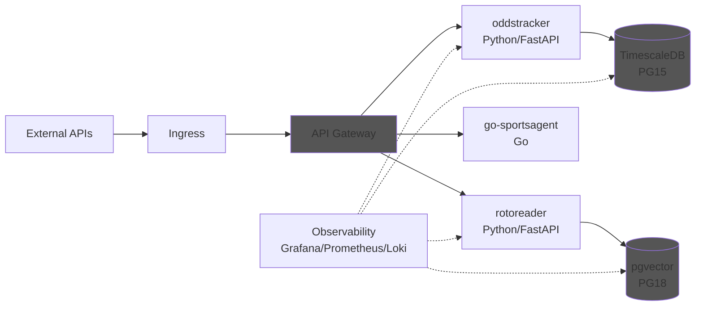

# SportsStack Platform

A personalized stack of sports data services for tracking and analyzing favorite teams.

## Overview

SportsStack integrates multiple microservices to collect, process, and serve sports data, including betting odds and news articles. The architecture is designed for scalability and resilience, leveraging Kubernetes for orchestration and Helm for deployment.

### Goals

- Bring real-time and historical stats into one place
- Enable programmable analyses and alerts
- Provide a clean API surface for exploration and automation

### Usage

- See [docs/usage.md](docs/usage.md) for detailed instructions on setting up the environment, building images, deploying services, and monitoring the system.

## Components

- **rotoreader**: A FastAPI service that scrapes and processes sports news articles.
- **oddstracker**: A FastAPI service that collects and tracks odds and stats from various sources.
- **api-gateway**: A Spring Cloud Gateway that centralizes access to backend services.
- **go-sportsagent**: A Go-based service that provides additional sports data functionalities.
- **TimescaleDB**: A time-series database for storing odds and stats data.
- **pgvector**: A PostgreSQL extension for vector similarity search, used by rotoreader.
- **Observability Stack**: Grafana, Prometheus, Loki, and Tempo for monitoring and logging of telemetry data.

## Workflow

## Observability Stack

- Bootstrap Prometheus, Grafana, Loki, and Tempo: `just helm-observability-install`.
- Uninstall stack and clean transient Loki storage: `just helm-observability-uninstall`.
- Grafana now ships with Tempo as the tracing source for Grafana Explore (OTLP over gRPC at `observability-tempo:4317`).
- After pulling chart changes, run `helm dependency update charts/observability` to sync the vendored dependencies.

## Structure Highlights

- `api-gateway/`: Spring Cloud Gateway service, Dockerfile builds `maxo5499/sportsstack-api-gateway:latest`.
- `rotoreader/`: FastAPI data collector, Dockerfile builds `maxo5499/sportsstack-rotoreader:latest`.
- `oddstracker/`: FastAPI betting odds tracker, Dockerfile builds `maxo5499/sportsstack-oddstracker:latest`.
- `go-sportsagent/`: Go service for sports agent functionality, Dockerfile builds `maxo5499/sportsstack-go-sportsagent:latest`.
- `k8s/`: Namespace, ConfigMap, Postgres StatefulSet, rotoreader and oddstracker Deployments/HPAs/CronJobs, API gateway Deployment, ingress, and setup README.
- `charts/`:
  - `sportsstack-db/`: Helm chart for DB ConfigMap and optional in‑cluster Postgres. Toggle external vs in‑cluster DB without changing app manifests.
  - `oddstracker/`: Helm chart for oddstracker Deployment, Service, HPA, and CronJob.
  - `rotoreader/`: Helm chart for rotoreader Deployment, Service, HPA, and CronJob.
  - `api-gateway/`: Helm chart for api-gateway Deployment and Service.
  - `go-sportsagent/`: Helm chart for go-sportsagent Deployment, Service, and HPA.
- `.github/copilot-instructions.md`: Contributor guidance for this repository.
