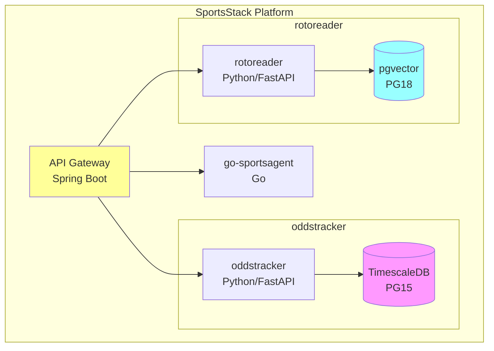

# Diagrams

- In progress

## Components

```mermaid
graph TB
    subgraph "SportsStack Platform"
        APIGW[API Gateway<br/>Spring Boot]
        
        subgraph "oddstracker"
            ODD[oddstracker<br/>Python/FastAPI]
            ODDDB[(TimescaleDB<br/>PG15)]
        end
        
        subgraph "rotoreader"
            ROTO[rotoreader<br/>Python/FastAPI]
            ROTODB[(pgvector<br/>PG18)]
        end
        
        AGENT[go-sportsagent<br/>Go]
    end
    
    APIGW --> ODD
    APIGW --> ROTO
    APIGW --> AGENT
    
    ODD --> ODDDB
    ROTO --> ROTODB
    
    style ODDDB fill:#f9f
    style ROTODB fill:#9ff
    style APIGW fill:#ff9
```
